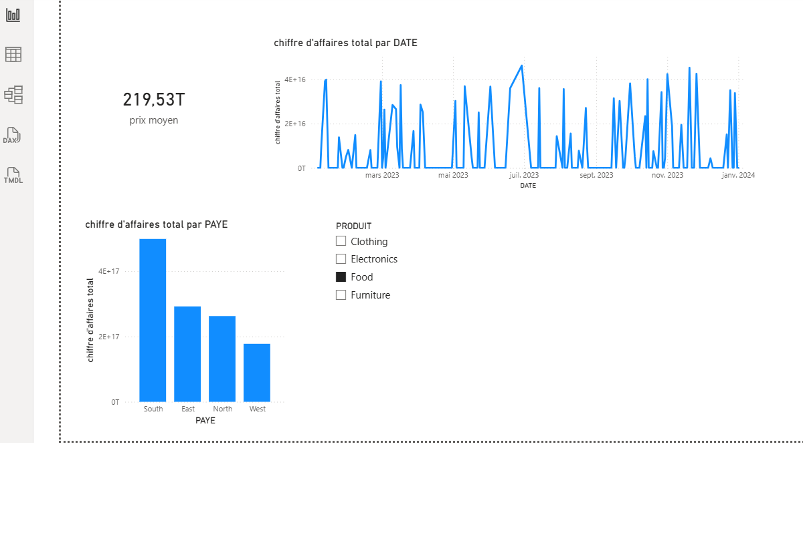

# powerbi-analyse-ventes
Analyse des ventes avec Power BI (projet personnel)

📊 Description
Projet personnel d’analyse des ventes réalisé avec Power BI.
Objectif : créer un dashboard interactif pour le suivi de la performance commerciale.

🧹 Préparation des données
- Nettoyage des données avec Power Query
- Gestion des types de données (dates, nombres, entiers)
- Suppression des valeurs non numériques

📈 Analyse & Visualisation
- Chiffre d’affaires total
- Prix moyen
- Analyse par produit, pays et période
- KPIs et segments interactifs

 🛠️ Outils utilisés
- Power BI
- Power Query
- DAX
- Excel

Résultats
- Suivi des KPI commerciaux
- Analyse des ventes par produit, pays et période
- Visualisation claire pour un usage décisionnel
📷 Aperçu du dashboard

👩‍💼 Profil
Master2 en Management et Commerce International, orientée analyse data et business intelligence.
